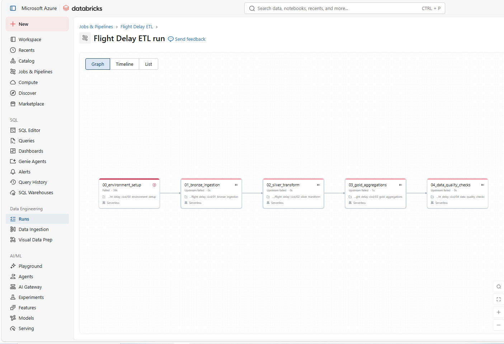

# ✈️ Flight Delay Data Engineering Pipeline

An end-to-end data engineering project that ingests U.S. airline on-time performance data, processes it through a **Bronze → Silver → Gold** architecture in Azure Databricks, validates data quality, orchestrates the pipeline with Apache Airflow, deploys code through CI/CD, and serves analytics through Power BI.

The project demonstrates a production-style data engineering workflow using **Azure, Databricks, PySpark, Delta Lake, Apache Airflow, GitHub Actions, automated testing, and Power BI**.

---

## 🏗️ Architecture

```text
BTS TranStats CSV
       │
       ▼
Azure Data Lake Storage Gen2
       │
       ▼
┌─────────────────────────────┐
│     Azure Databricks        │
│                             │
│  Bronze → Silver → Gold     │
│       PySpark / Delta       │
│                             │
│    Data Quality Checks      │
└──────────────┬──────────────┘
               │
               ▼
       Apache Airflow
        Orchestration
               │
               ▼
          Power BI
       Analytics Layer

GitHub
   │
   ├── CI → Automated Tests
   │
   └── CD → Databricks Deployment
```

---

## 🛠️ Technology Stack

| Layer | Technology |
|---|---|
| Cloud | Microsoft Azure |
| Storage | Azure Data Lake Storage Gen2 |
| Processing | Azure Databricks |
| Transformation | PySpark |
| Storage Format | Delta Lake |
| Architecture | Bronze / Silver / Gold |
| Orchestration | Apache Airflow |
| Containers | Docker |
| Testing | Pytest / PySpark |
| CI/CD | GitHub Actions |
| Visualization | Power BI |
| Version Control | Git / GitHub |

---

## 🔄 Pipeline Overview

The pipeline moves flight data through several stages:

1. **Bronze Ingestion** – Loads raw BTS flight data into the Databricks environment.
2. **Silver Transformation** – Cleans, standardizes, and enriches flight-level data using PySpark.
3. **Gold Aggregation** – Creates analytics-ready tables for airport, route, daily, and overall flight performance.
4. **Data Quality Validation** – Checks pipeline outputs before downstream consumption.
5. **Airflow Orchestration** – Triggers and monitors the Databricks ETL workflow.
6. **Power BI Analytics** – Connects to the Gold layer for reporting and visualization.

---

## 🧱 Databricks ETL

Azure Databricks performs the primary transformation workload using PySpark and Delta tables.



The ETL process follows a medallion architecture:

### Bronze Layer

The Bronze layer preserves the raw flight dataset and provides the source for downstream transformations.

### Silver Layer

The Silver layer applies reusable PySpark transformation logic to clean and enrich the flight records.

Key transformations include:

- Departure delay indicators
- Arrival delay indicators
- Cancellation handling
- Delay-cause calculations
- Route generation
- Standardized fields for downstream analytics

### Gold Layer

The Gold layer produces business-ready aggregates used by Power BI.

Primary outputs include:

- `gold_summary`
- `gold_airport_performance`
- `gold_route_performance`
- `gold_daily_performance`


---

## 🧪 Automated Testing

The project includes automated PySpark unit tests for the Silver transformation layer.

Tests validate business logic including:

- Departure delay flags
- Arrival delay flags
- Cancellation reasons
- Total delay-cause minutes
- Route creation


This allows transformation logic to be validated before deployment and execution in the production-style pipeline.

---

## 🔍 Data Quality Checks

Data quality validation is incorporated into the Databricks workflow after the transformation and aggregation stages.

Checks are performed against pipeline outputs to help detect:

- Missing or unexpected values
- Invalid metrics
- Incorrect aggregation results
- Pipeline output issues

This provides an additional validation layer before data reaches Power BI.

---

## ⚙️ Databricks Job Orchestration

The Databricks workflow executes the ETL stages in the required order.


The workflow ensures that downstream transformations and validation steps execute only after their required upstream dependencies complete successfully.

A repaired and validated job run is shown below:


---

## 🌬️ Apache Airflow Orchestration

Apache Airflow provides the external orchestration layer for the Databricks pipeline.


The Airflow DAG coordinates execution of the Databricks workflow rather than reproducing the transformation logic inside Airflow.


The orchestration workflow was successfully tested end-to-end:


Additional Airflow build logic:


Airflow runs locally through Docker while Databricks performs the cloud-based ETL workload.

---

## 🚀 CI/CD Pipeline

GitHub Actions provides automated testing and deployment.


### Continuous Integration

The CI workflow runs automated tests when project code changes.

The pipeline validates:

- PySpark transformation logic
- Required project files
- Python syntax
- Transformation behavior

### Continuous Deployment

After validation, the CD workflow authenticates with Databricks and deploys the repository's Databricks code into the Databricks workspace.

This separates:

```text
Development
     ↓
GitHub
     ↓
Automated Testing
     ↓
Deployment
     ↓
Databricks
```

from manual notebook-only development.

---

## 📊 Power BI Integration

Power BI connects to the Databricks Gold layer to consume analytics-ready tables.


The connection allows Power BI to focus on reporting and visualization while transformation and aggregation logic remains in the data engineering layer.


---

## 📈 Power BI Dashboard

The final reporting layer presents flight performance metrics and trends.


The dashboard includes analysis of:

- Total flights
- Delay rates
- Cancellation rates
- Average arrival delay
- Average departure delay
- Airport performance
- Route performance
- Daily and weekly trends

Additional dashboard overview:


---

## 🔐 Credential Management

Credentials and access tokens are intentionally excluded from source control.

Authentication values are handled through environment variables and GitHub repository secrets rather than hard-coded credentials.

The project uses secured authentication for services such as:

- Azure Databricks
- Apache Airflow → Databricks
- GitHub Actions → Databricks
- Power BI → Databricks

> Screenshots involving authentication are included only to demonstrate configuration flow. Active credentials should never be committed to the repository.

---

## 📁 Repository Structure

```text
flight-delay-data-pipeline/
│
├── dags/
│   └── flight_delay_pipeline.py
│
├── databricks/
│   ├── 01_bronze_ingestion.py
│   ├── 02_silver_transform.py
│   ├── 03_gold_aggregations.py
│   └── 04_data_quality_checks.py
│
├── src/
│   └── silver_transformations.py
│
├── tests/
│   ├── conftest.py
│   ├── test_project.py
│   └── test_silver_transform.py
│
├── images/
│
├── powerbi/
│
├── .github/
│   └── workflows/
│       ├── ci.yml
│       └── cd.yml
│
├── Dockerfile
├── docker-compose.yml
├── requirements.txt
└── README.md
```

---

## 📊 Gold Layer Metrics

The Gold layer provides reporting-ready KPIs such as:

### Overall Performance

- Total Flights
- Delayed Flights
- Cancelled Flights
- Diverted Flights
- Average Arrival Delay
- Average Departure Delay
- Delay Rate %
- Cancellation Rate %

### Airport Performance

- Delayed Departures
- Cancelled Flights
- Average Departure Delay
- Departure Delay Rate %
- Cancellation Rate %

### Route Performance

Aggregated route-level performance enables identification of routes with consistently high delays.

### Daily Performance

Daily and weekly aggregations support time-series analysis in Power BI.

---

## 📂 Data Source

The project uses the **U.S. Department of Transportation Bureau of Transportation Statistics (BTS) TranStats On-Time Performance dataset**.

The dataset contains flight-level information including:

- Origin and destination airports
- Scheduled and actual departure times
- Scheduled and actual arrival times
- Delays
- Cancellations
- Diversions
- Carrier information
- Delay causes

The project currently demonstrates the pipeline using **May 2026 flight data**.

---

## 🎯 Engineering Concepts Demonstrated

This project demonstrates practical experience with:

- End-to-end ETL pipeline development
- Cloud data engineering
- PySpark transformations
- Delta Lake
- Medallion architecture
- Data quality validation
- Unit testing
- Workflow orchestration
- Apache Airflow
- Databricks Jobs
- Docker
- CI/CD
- GitHub Actions
- Secure credential management
- Data modeling
- BI integration
- Production-style separation of transformation and reporting layers

---

## 🔮 Potential Enhancements

Future improvements could include:

- Parameterized monthly ingestion
- Incremental Delta Lake processing
- Databricks Auto Loader
- Additional data-quality monitoring
- Pipeline alerting
- Infrastructure as Code with Terraform
- Cloud-hosted Airflow
- Automated Power BI refresh
- Multi-month historical analysis

---

## 📌 Project Summary

This project demonstrates an end-to-end data engineering workflow rather than a standalone analytics dashboard.

```text
Raw Flight Data
      ↓
Azure Data Lake
      ↓
Databricks Bronze
      ↓
PySpark Silver
      ↓
Gold Analytics Tables
      ↓
Data Quality Validation
      ↓
Airflow Orchestration
      ↓
Power BI
```

GitHub Actions adds automated testing and deployment around the pipeline, providing a complete workflow from **source-controlled code → testing → deployment → orchestration → analytics**.
